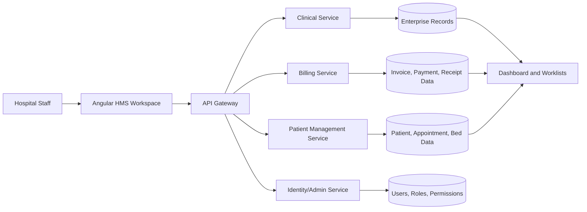
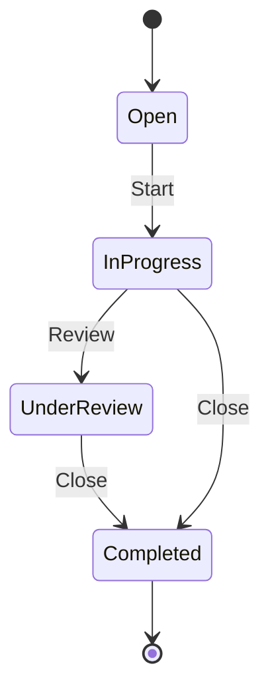
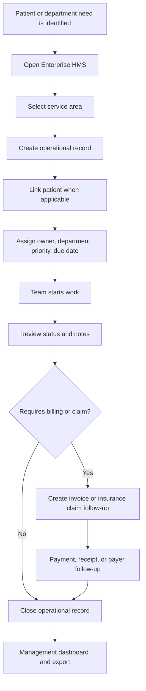

# Enterprise Operations Workflow

## Purpose

Enterprise HMS is the hospital-wide operations desk. It is used when work must be tracked across departments, assigned to an owner, followed by status, linked to a patient when needed, and reviewed by management.

It covers:

| Area | Typical Use |
|---|---|
| Pharmacy | Dispensing, stock posting, counselling, pharmacy charge follow-up |
| Laboratory | Sample collection, result verification, report release |
| Radiology | Imaging request, modality scheduling, report reference |
| Inpatient | Admission worklist, bed assignment, ward handoff |
| Emergency | Triage, stabilization, investigation, admission/discharge handoff |
| Operating Theatre | Theatre booking, checklist, anesthesia readiness, recovery |
| Inventory | Stock movement, reorder, expiry, department issue |
| Procurement | Purchase request, quotation, approval, purchase order, goods receiving |
| Asset Management | Asset registration, custodian, warranty, inspection |
| Biomedical Maintenance | Equipment fault, calibration, spare parts, release to service |
| Insurance Claims | Eligibility, claim file, payer follow-up, remittance |
| Security Audit | User access review, role validation, exception tracking |
| Notifications | Email/SMS task, delivery status, retry follow-up |
| Documents | Patient document indexing, consent form reference, scanned files |
| Reporting | Daily performance, queue, bed occupancy, workload, A/R |
| Integration | Payment gateway, payer API, SMS gateway, lab equipment checks |

## Operating Model

## Record Lifecycle

Every Enterprise HMS item follows the same lifecycle.

## End-to-End Workflow

## How To Use Enterprise HMS

1. Login as an administrator or authorized operational user.
2. Open **Enterprise HMS** from the left navigation.
3. Select the service area, for example **Pharmacy**, **Laboratory**, **Insurance Claims**, or **Biomedical**.
4. Click the action button such as **Dispense Medication**, **Process Result**, **Prepare Claim**, or **Create Work Order**.
5. Fill the record:
   - Patient, if the record is patient-related
   - Title
   - Department
   - Owner
   - Priority
   - Status
   - Value, when financial tracking is needed
   - Due date
   - Details
6. Use the worklist buttons:
   - **Start** moves the record to `In Progress`
   - **Review** moves the record to `Under Review`
   - **Close** moves the record to `Completed`
7. Use **Excel** or **Print** for handoff, review meetings, or department reporting.

## Integration With Existing Modules

| Existing Module | Enterprise HMS Integration |
|---|---|
| Patients | Records can be linked to a patient and show patient name in the worklist |
| Appointments and Queue | Emergency, outpatient, radiology, lab, and pharmacy work can follow the patient journey |
| Clinical | Prescriptions, lab requests, diagnoses, and encounters can trigger operational follow-up |
| Billing | Claims, pharmacy charges, imaging charges, and other service work can be followed through payment |
| Administration | Owners, departments, roles, and permissions control responsibility and access |
| Dashboard | Enterprise records contribute to operational visibility and management review |

## Recommended Department Usage

| Department | Daily Action |
|---|---|
| Pharmacy | Review prescription-related records, dispense, post stock, close after counselling |
| Laboratory | Review lab tasks, collect sample, process, verify, release result |
| Radiology | Schedule imaging, update status, attach report reference in details |
| Inpatient | Track admission, ward handoff, bed work, discharge preparation |
| Emergency | Track triage and stabilization tasks until admitted or discharged |
| Finance | Follow invoices, claims, outstanding balances, and receipt confirmation |
| Stores | Track reorder, receiving, issue, expiry, and stock exceptions |
| Biomedical | Track equipment faults, calibration, service history, and release to service |
| IT/Admin | Track notifications, integrations, security reviews, and document indexing |

## First-Phase Acceptance Checklist

Use this checklist before handing the system to a test hospital team:

| Check | Expected Result |
|---|---|
| Admin login works | Admin can access all modules |
| Employee onboarding works | New user receives setup link or appears in Email Outbox |
| Patient registration works | Patient appears in patient list with photo/insurance data |
| Appointment queue works | Queue number, doctor, department, and status are visible |
| Clinical workflow works | Encounter, vitals, diagnosis, prescription, and lab request can be created |
| Billing workflow works | Invoice, payment, receipt, print, and balance tracking work |
| Enterprise record creation works | New record appears under the selected service area |
| Enterprise status updates work | Start, Review, and Close update the worklist |
| Export/print works | Worklists can be printed or exported |
| Gateway routing works | Frontend uses `http://localhost:5200` |
| PostgreSQL persistence works | Data remains after service restart |

## Operating Principle

Enterprise HMS should be used for accountable cross-department work. If a task has an owner, due date, patient reference, financial value, department handoff, or management visibility requirement, it belongs in Enterprise HMS.
