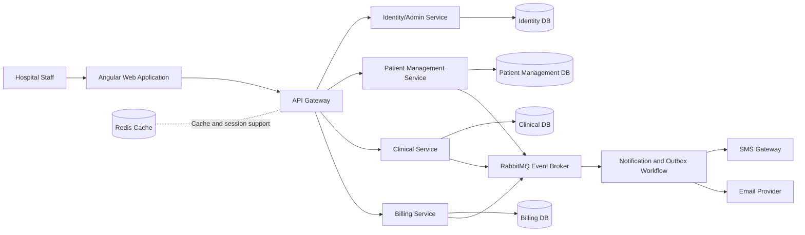
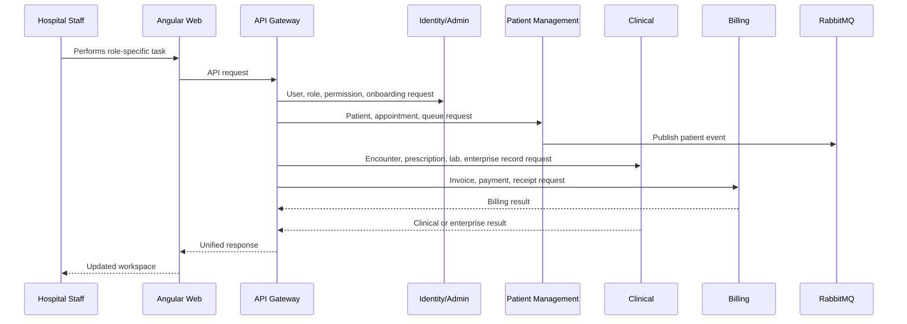
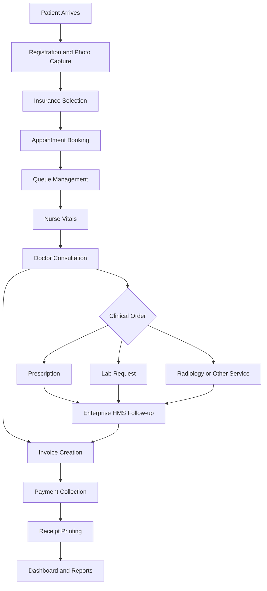

# HMS Platform Architecture Brief

## Executive Summary

The HMS Platform is a modular hospital management system designed to support daily hospital operations from patient registration to clinical care, billing, and management visibility.

The system uses a web-first architecture with a single Angular workspace, an API Gateway, independent backend services, PostgreSQL databases, and RabbitMQ for event-driven communication. This gives the organization a maintainable foundation that can be deployed to hospitals, expanded by module, and commercialized through subscription, implementation, and support packages.

## High-Level Architecture

## Core Design Principles

| Principle | Meaning | Benefit |
|---|---|---|
| Modular services | Each business area has a clear service boundary | Easier maintenance and safer expansion |
| API Gateway | Frontend communicates through one controlled entry point | Better routing, security, and monitoring |
| Database ownership | Each service owns its operational data | Lower coupling and clearer accountability |
| Event-driven communication | RabbitMQ handles asynchronous business events | Enables notifications, audit, and integration |
| Role-based access | Users see functions based on role and permission | Stronger control and accountability |
| Web-first workflow | Staff use one browser-based workspace | Easier hospital adoption and support |

## Main System Modules

### 1. Identity and Administration

Purpose:
- User login
- Employee and system user registration
- Role and permission management
- Department management
- Password setup and reset workflow
- Email outbox for onboarding visibility

Workflow:
1. Admin creates a user.
2. System creates the account in a pending state.
3. User receives a password setup link by SMTP or Email Outbox.
4. User sets a password.
5. User signs in and receives role-specific access.

### 2. Patient Management

Purpose:
- Patient registration
- Patient photo capture
- Insurance provider selection
- Appointment booking by department and doctor
- Queue management
- Bed and admission readiness

Workflow:
1. Receptionist registers patient and captures photo.
2. Insurance provider is selected when applicable.
3. Appointment is booked by department and doctor.
4. Queue position is generated and tracked.
5. Patient registration event is published for downstream processing.

### 3. Clinical Service

Purpose:
- Clinical encounters
- Vitals
- Diagnoses
- Prescriptions
- Lab requests
- Enterprise operations records

Workflow:
1. Nurse records vitals.
2. Doctor opens the patient clinical record.
3. Doctor records diagnosis, notes, treatment plan, prescription, or lab request.
4. Prescription can be printed with hospital branding.
5. Enterprise records track pharmacy, lab, radiology, inpatient, emergency, theatre, and other operational follow-up.

### 4. Billing Service

Purpose:
- Invoice creation
- Service line items
- Insurance and cash billing support
- Payment collection
- Receipt printing
- Outstanding balance review

Workflow:
1. Billing staff selects patient.
2. Invoice is created with service items.
3. Insurance provider is selected where applicable.
4. Payment is recorded.
5. Receipt is printed with official branding.
6. Outstanding balance remains visible for follow-up.

## Module Communication

## End-to-End Hospital Workflow

## Role-Based Workflow

| Role | Main Operations |
|---|---|
| Admin | Users, roles, permissions, departments, service monitoring |
| HR Manager | Employee onboarding and account management |
| Receptionist | Patient registration, photo capture, appointments, queue |
| Nurse | Vitals capture and patient preparation |
| Doctor | Consultation, diagnosis, prescriptions, lab requests |
| Lab Technician | Lab request review and processing |
| Pharmacist | Prescription review and dispensing workflow |
| Accountant | Invoice creation, billing review, finance reporting |
| Cashier | Payment collection and receipt printing |
| Operations Lead | Enterprise HMS follow-up across departments |

## Enterprise Operations Coverage

The system includes an Enterprise HMS workspace for hospital-wide operational control. Each service area supports record creation, patient linking, owner assignment, priority, due date, status tracking, print, and export.

| Service Area | Operational Use |
|---|---|
| Pharmacy | Dispensing, stock posting, counselling, and pharmacy charge follow-up |
| Laboratory | Sample collection, result processing, verification, and report release |
| Radiology | Imaging request, modality scheduling, report reference, and release workflow |
| Inpatient | Admission worklist, bed assignment, ward handoff, and discharge preparation |
| Emergency Department | Triage, stabilization, investigation request, and handoff |
| Operating Theatre | Theatre booking, team readiness, checklist, anesthesia preparation, recovery tracking |
| Inventory | Stock movement, reorder trigger, expiry check, receiving, and department issue |
| Procurement | Purchase request, quotation follow-up, approval, purchase order, and goods receiving |
| Asset Management | Asset registration, custodian assignment, location tracking, warranty, inspection |
| Biomedical Maintenance | Equipment fault ticket, engineer assignment, calibration, spare parts, release to service |
| Insurance Claims | Eligibility check, claim preparation, submission follow-up, remittance posting |
| Security Audit | User access review, role validation, exception tracking, and evidence archiving |
| Notifications | Email/SMS task tracking, delivery follow-up, retry handling |
| Documents | Patient document indexing, consent reference, scanned attachment tracking |
| Reporting | Daily performance pack, revenue, queue, bed occupancy, workload, A/R |
| Integration | Payment gateway, SMS gateway, payer interface, lab equipment, reconciliation checks |

## Dashboard and Management Visibility

The dashboard gives management a quick view of:

- Total employees
- Total patients
- Active queue count
- Clinical workload
- Open financial balance
- Revenue health
- Queue flow
- Clinical workload
- Enterprise operation workload

This helps leadership monitor patient flow, workload, revenue, and department accountability from one workspace.

## Why This Architecture Is Strong

1. It is scalable: each service can be expanded independently.
2. It is secure: identity, roles, and permissions are centralized.
3. It is practical: hospital staff use one unified web interface.
4. It is integration-ready: RabbitMQ supports asynchronous communication.
5. It is maintainable: services follow hospital business boundaries.
6. It is commercially ready: modules can be licensed, deployed, and expanded by hospital size.

## Production Hardening Backlog

Recommended next steps before live hospital rollout:

- Refresh-token/session revocation and optional external identity provider integration
- Migration review and release governance for each service database
- Audit trail and immutable activity history
- Production SMS gateway integration
- Centralized logging, monitoring, metrics, and alerting
- GitLab CI/CD pipeline
- Backup, restore, and disaster recovery procedures
- Hospital-specific approval flows, reports, forms, and regulatory templates

## CEO-Level Conclusion

The HMS Platform provides a strong technical and commercial foundation for hospital deployment. It supports core hospital workflow, department operations, billing, and management visibility through one browser-based system.

The architecture is modular enough for long-term expansion, but practical enough for phased deployment. This positions the organization to enter the hospital software market with a system that can generate revenue through implementation fees, annual subscription, support, customization, and future integration services.
